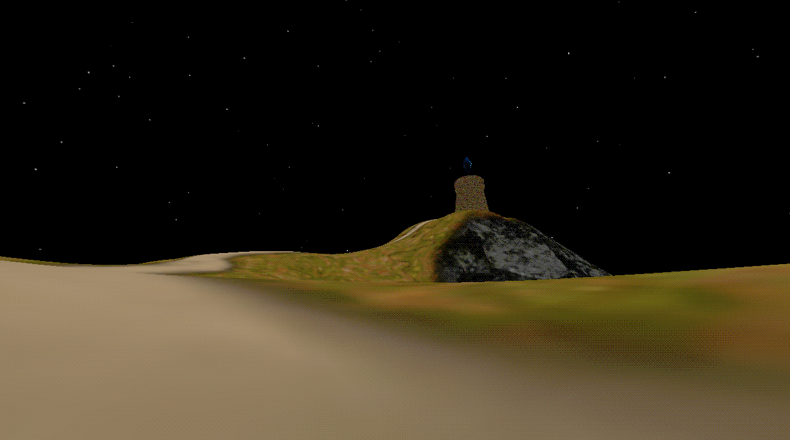
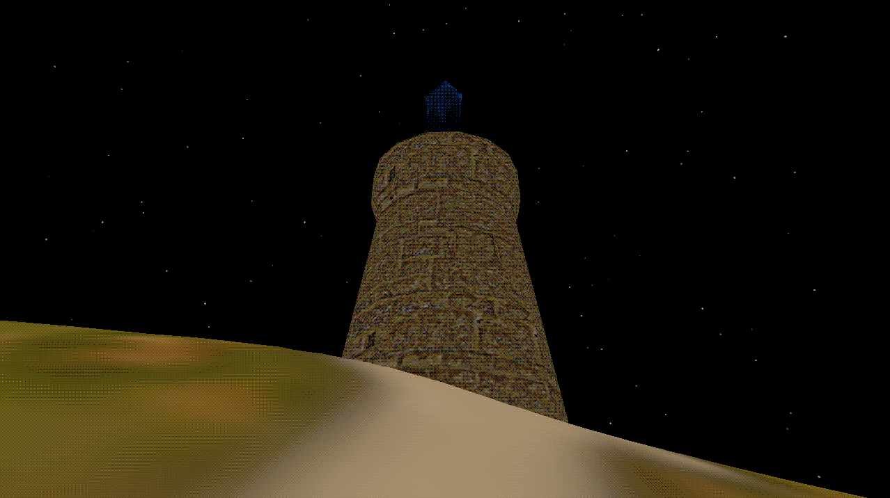

<h1 align="center">🌿 Kvet'</h1>
<p align="center"><em><b>A modern 3D game and render engine built with C++20 and Vulkan</em></b></p>

---

## 🎯 Overview

[](https://sonarcloud.io/summary/new_code?id=Leer-err_X11Engine)

**Kvet'**  is a real-time 3D game engine written from scratch in modern C++20. It features a Vulkan rendering backend, a fully custom Entity-Component-System (ECS) architecture.

## 📸 Screenshots

<table>
  <tr>
    <td align="center"><b>🏝️ Island View</b></td>
    <td align="center"><b>🏔️ Landscape</b></td>
    <td align="center"><b>🗼 Tower</b></td>
  </tr>
  <tr>
    <td></td>
    <td></td>
    <td></td>
  </tr>
  <tr>
    <td align="center"><b>Dithering + Color Quantization (x16)</b></td>
    <td align="center"><b>No Post-Processing</b></td>
    <td></td>
  </tr>
  <tr>
    <td></td>
    <td></td>
    <td></td>
  </tr>
</table>

## 🛠️ Tech Stack

| Category          | Technology                                          |
| ----------------- | --------------------------------------------------- |
| **Language**      | C++20                                               |
| **Rendering**     | Vulkan 1.3                                          |
| **Windowing**     | SDL3                                                |
| **Profiling**     | Tracy                                               |


## 🧱 Architecture

```
src/
├── main.cpp                     # Application entry point
├── Core/                        # Core engine subsystems
│   ├── Core.cpp / Core.h        # Core initializer & lifecycle
│   ├── Config/                  # Configuration management (Window, Graphics)
│   ├── ECS/                     # Custom Entity-Component-System framework
│   ├── Engine/                  # Engine singleton, main loop, system pipeline
│   ├── Event/                   # Event system
│   ├── File/                    # File I/O and model reader
│   ├── Graphics/                # Vulkan renderer & abstraction layer
│   ├── Input/                   # Input handling (PhysicalInput, InputContext)
│   ├── Logger/                  # Logging subsystem
│   ├── Physics/                 # PhysX integration (RigidBody, Shape, Scene)
│   ├── Script/                  # Lua scripting & C++ bindings
│   ├── Types/                   # Math (Vector, Matrix, Quaternion), Vertex, Result, Transform
│   ├── Utility/                 # TypeId utilities
│   └── Window/                  # SDL3 window management
└── Scene/                       # Scene graph & runtime
    ├── Camera/                  # Camera system
    ├── GameInputContext/        # Game-specific input bindings
    ├── Scripts/                 # Built-in Lua scripts (MoveScript, LookScript)
    └── Sky/                     # Sky, Stars, and Clouds subsystems
```

### 🧩 ECS Design

The custom ECS implementation provides:

- **Entity Registry**: Manages entity lifecycle (create, kill, query by ID)
- **Component Registry**: Type-safe component storage via `ComponentPool<T>`
- **System Dispatcher**: Schedules and runs system updates each frame
- **Query Builder**: DSL for iterating entities matching component signatures

## 📦 Dependencies

All external dependencies are managed as **Git submodules**:

```bash
git submodule update --init
# or use the helper script:
./get_dependencies.sh
```

| Dependency               | Purpose               |
| ------------------------ | --------------------- |
| PhysX                    | Physics simulation    |
| Assimp                   | 3D model import       |
| Dear ImGui               | Debug UI & tooling    |
| sol2                     | Lua C++ bindings      |
| SDL3                     | Window & input        |
| GLM                      | Vector/matrix math    |
| vk-bootstrap             | Vulkan boilerplate    |
| VulkanMemoryAllocator    | GPU memory allocator  |
| SPIRV-Reflect            | Shader introspection  |
| stb                      | Image loading         |

## 🔧 Building

### Prerequisites

- **Windows** (MSVC toolchain)
- **CMake 3.21+**
- **Ninja** build system
- **Vulkan SDK** (set `VULKAN_SDK` environment variable)

### Commands

```bash
# Clone with all submodules
git clone --recurse-submodules <repo-url>
cd Kvet

# Configure (Debug)
cmake --preset Debug -G Ninja

# Build
cmake --build out/build/Debug

# Or configure (Release)
cmake --preset Release -G Ninja
cmake --build out/build/Release
```

The built executable and assets will be located in `out/build/<config>/bin/`.

## 📐 Coding Standards

- **C++20** with `-fno-exceptions` style where appropriate
- ECS-driven architecture — favor composition over inheritance
- Code formatting via `.clang-format`

## 📄 License

This project is licensed under the **MIT License** — see the [LICENCE.md](LICENCE.md) file for details.

## 🙏 Acknowledgements

Built with inspiration from numerous open-source game engines and the Vulkan community. Special thanks to all the amazing library authors whose work makes my project development possible and enjoyable.

---

<p align="center"><sub>Made with ❤️ by <a href="https://github.com/Leer-err">Leer-err</a></sub></p>